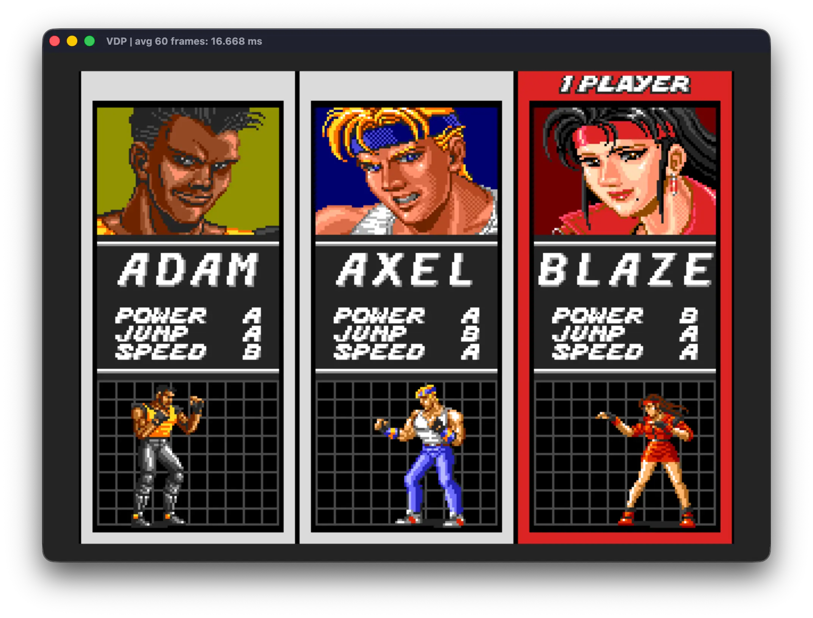
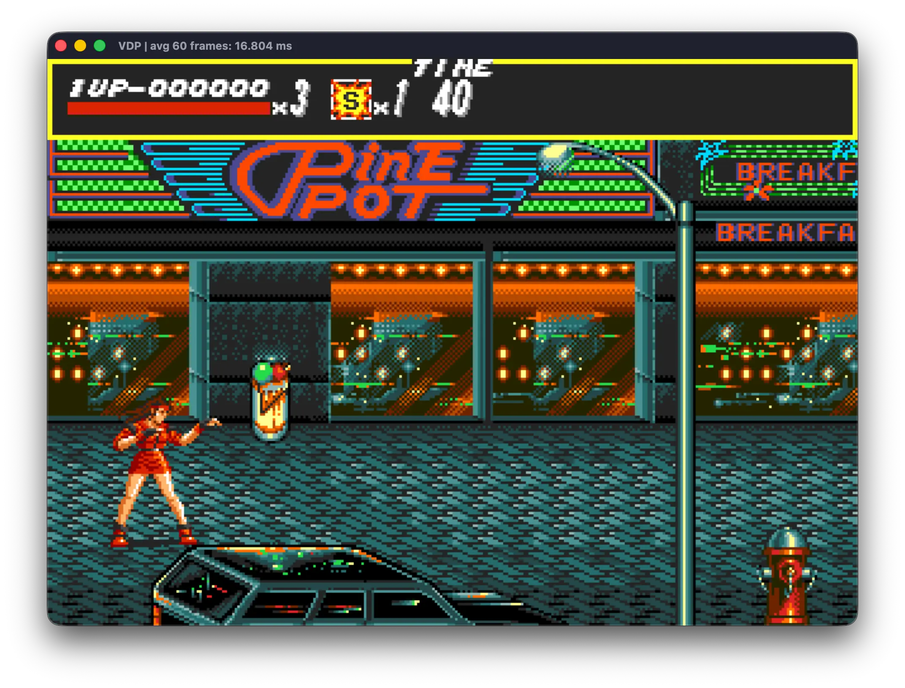
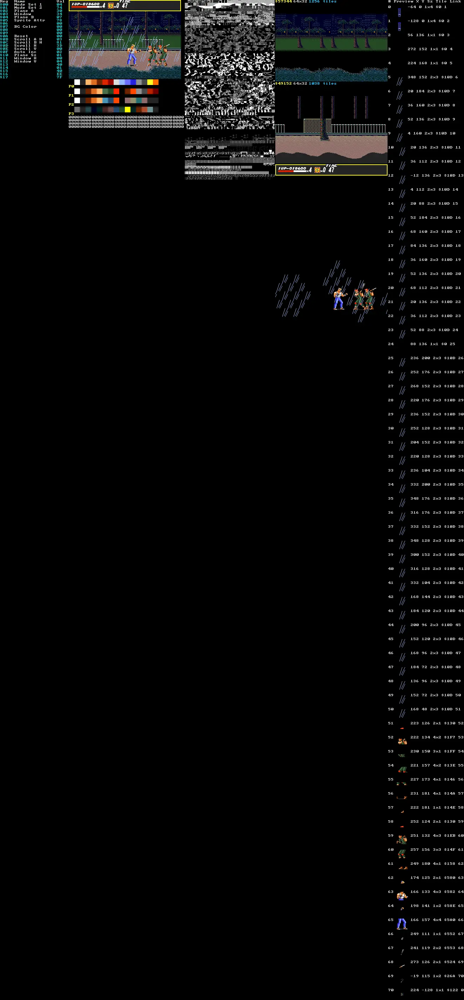

# Streets of Rage Project

<p align="center">
 
</p>

Welcome to my reverse-engineering and recompilation project for SEGA's
celebrated Mega Drive classic (released as SEGA Genesis in the United States),
*Streets of Rage*.


This is a strictly academic, non-commercial project. If you are looking for a
free copy of the game, this repository is not the place to find one: **it does
not contain copyrighted game material**. The original ROM is deliberately
omitted; you must provide a compatible image that you are legally entitled to
use.

The project brings together several components whose primary purpose is to
recompile Streets of Rage faithfully and make its internals available for
study.

## Project structure

<p align="center">
 
</p>

| Submodule / directory | Purpose |
| --- | --- |
| [`MegaDriveEnvironment/`](MegaDriveEnvironment/) | SDL3-based Mega Drive host runtime and reusable C++ library |
| [`StreetsOfRageRecompilation/`](StreetsOfRageRecompilation/) | Generated and hand-written C++, analysis data, build scripts, and the `sor` executable |
| [`RageDecompiler/`](RageDecompiler/) | Python tools for disassembly, recompilation, label generation, and runtime discovery |
| [`MegaDriveEnvironmentSampleGame/`](MegaDriveEnvironmentSampleGame/) | A small game targeting both the PC runtime and real Mega Drive hardware |
| [`autoplay/`](autoplay/) | Python remote observer for a running `sor` host |

The playable host expects `MegaDriveEnvironment`, `RageDecompiler`, and
`StreetsOfRageRecompilation` to remain sibling directories. This is the layout
created by the meta-repository.

### Acknowledgments

I would like to thank [ekeeke for the Genesis Plus GX](https://github.com/ekeeke/genesis-plus-gx), which served almost as a technical document for the Sega Mega Drive, and [gsaurus for its Streets of Rage](https://github.com/gsaurus/sor-disassemblies/) disassembly (and annotations), which provided an important starting point for the analysis of the game. And of course, my slaves: Claude, ChatGPT, and Grok 4.5. Without them, this work would be impossible for my meat brain to do as a side project!

### The `RageDecompiler` recompiler

`RageDecompiler` disassembles the ROM into assembly and also transpiles the
required routines into C++ for the desktop build.

Minimal code generation is a deliberate design goal: the tool should emit no
more code than is necessary to execute the game. Particular care has been
taken with the challenges of translating an assembly-language program that
relies on patterns such as jump tables.

The recompiler is designed to operate in concert with the executable it
produces. During bootstrap, it recompiles the routines reachable from address
`0x200` and from the interrupt autovectors, together with every routine reached
through a direct call from those entry points.

Some subroutines, however, are not reachable through direct calls. To account
for them, the disassembler/recompiler consumes the auxiliary file
`StreetsOfRageRecompilation/code-analysis/aux_addresses.txt`. This file records
call-site addresses and tells the recompiler where to look for additional
functions. At runtime, `StreetsOfRageRecompilation` writes to *stdout* the
addresses that are called but do not yet have an equivalent compiled function.

The initial assumption was that exercising the game would expose a small set
of entry points and that most of the remaining routines would be reached from
them. In practice, the control-flow structure is substantially more complex;
the same subroutine may also be referenced by multiple call sites.

The project therefore includes a speculative discovery mode. The recompiler
searches the ROM for plausible code, emits it, and provides support for
potential call sites. As the game runs, confirmed addresses are added to
`aux_addresses.txt`. This makes it possible to discover dozens or hundreds of
addresses in a single compilation without restarting the game.

The discovery loop is:

**exercise the game** → **record new addresses** → **recompile** → **play again**

The project supports both conservative discovery and a smart mode that uses
speculative addresses.

### The `MegaDriveEnvironment` development and runtime library

Producing code that could execute directly on a PC would be impractical while
the recompilation still depends on the Mega Drive's video, audio, and input
subsystems.

`MegaDriveEnvironment` serves two closely related purposes. It can be used to
develop Mega Drive games as native PC applications: instead of targeting APIs
such as Vulkan or DirectX, the application uses an emulated Mega Drive VDP
(Video Display Processor). The same approach is used for controllers and
audio.

These emulated devices use SDL3 to communicate with the host operating
system's native APIs. As a result, between 90% and 100% of a Mega Drive game
can be developed as a PC application, while the same source can also produce a
ROM image for an emulator or original hardware. The source can likewise be
used to build a conventional application for PC, macOS, or Linux.

The accompanying `MegaDriveEnvironmentSampleGame` demonstrates this
cross-platform workflow, including a basic resource-packaging system for tiles,
audio samples, and Z80 programs.

Beyond development support, `MegaDriveEnvironment` provides the emulated VDP,
audio, controllers, and related devices that allow the static Streets of Rage
recompilation to run before its rendering engine, audio system, and other
hardware-facing subsystems have been reimplemented.

The long-term roadmap is:

1. Reimplement every game procedure in C++.
2. Refactor the code into a medium- or high-level architecture, with functions
   that accept explicit arguments and use dynamic memory where appropriate,
   while preserving the original gameplay rules.
3. Remove the dependency on the hardware emulated by `MegaDriveEnvironment`
   and implement the graphics pipeline, audio, and input directly through SDL.
4. Enable enhancements such as higher-resolution replacement assets, 16:9
   support, and variable frame rates, with object motion designed to benefit
   from the available frame rate.

### The recompiled game in `StreetsOfRageRecompilation`

The combination of the preceding tools produces the recompiled game in
`StreetsOfRageRecompilation`. That repository also contains the results of
several lines of analysis:

#### `output`

`RageDecompiler` can emit the recompiled game as C++ and can also produce an
assembly representation. The assembly is useful for human inspection and,
especially, for enabling LLMs to study the original program's behavior and
structure.

#### `ai-analysis`

Contains analyses of the code produced by multiple frontier-level language
models.

#### `code-analysis`

Contains the data that guides recompilation and analysis, including labels,
auxiliary addresses, and the list of manually reimplemented functions.

#### `generated`

Contains the C++ generated from the ROM. This directory is ignored by Git and
must be recreated after a fresh clone or whenever the ROM, analysis data, or
recompiler changes.

#### Hand-written code

Some parts of the program have already been reimplemented, with assistance
from LLMs, while preserving maximum compatibility with the remaining
recompiler-generated code. These parts include routines such as the
compressor/decompressor and substitutes for the "wait for VBlank" routines
that use busy waiting.

### The `autoplay` remote observer

`autoplay` is a Python application that attaches to a running `sor` executable
through the remote-access library shipped with `MegaDriveEnvironment`
(`megadrive_remote`). The game process remains the host; autoplay observes
live state over the remote connection without injecting controller input.

The app provides a live HUD that reports game mode, level, wave, timer, and
per-player status, together with a 2D world map of on-screen and off-camera
actors (including combat-phase outlines and hunt counts).

Launch instructions and CLI options are in `autoplay/README.md`.

## How to build

<p align="center">
 
 <br>Click to enlarge
</p>

### 1. Clone the repository and submodules

```bash
git clone --recurse-submodules https://github.com/RuiNelson/StreetsOfRageProject.git
cd StreetsOfRageProject
```

If the repository was cloned without submodules:

```bash
git submodule update --init --recursive
```

To restore all submodules to the commits recorded by the meta-repository:

```bash
git submodule update --init --recursive --checkout
```

### 2. Obtain a compatible ROM

The generated C++ under `StreetsOfRageRecompilation/generated/` is ignored by
Git and is not included in a fresh clone. Before the first build, generate it
from a compatible 512 KiB Streets of Rage / Bare Knuckle ROM image at:

```text
StreetsOfRageRecompilation/rom/SOR.bin
```

#### Legal and preservation considerations

The preferred way to obtain this image is to make a private dump of a physical
cartridge that you own, or that you are otherwise explicitly authorized to
access, using a compatible Mega Drive cartridge dumper. Follow the dumper's
documentation and verify the resulting file against the reference hashes
below. This approach also contributes to responsible preservation: it keeps the
source of the image clear and avoids relying on unverified downloads.

Copyright, archival-copy, reverse-engineering, and anti-circumvention rules
differ substantially between jurisdictions. Owning a cartridge does not
necessarily grant permission to redistribute its ROM, upload it, include it in
this repository, or bypass technical protection measures. Check the law that
applies to you before making or using a dump; this project provides technical
documentation, not legal advice. Keep the ROM private, use it only as permitted
by the applicable law, and do not share it with the project or its community.

The project is developed against the `JUE` cartridge, with these hashes:

| Property | Value |
| --- | --- |
| Size | `524288` bytes |
| CRC32 | `4052E845` |
| MD5 | `59a3b22a1899461dceba50d1ade88d3a` |
| SHA-256 | `95d7efb98e97f4ffffe68257aef9a855034a36a41b86cf9d332d129f30cb2d4b` |

ROM images are ignored by Git. Do not commit or redistribute them.

### 3. Common prerequisites

All three desktop platforms require:

- Git, including submodule support;
- CMake 3.24 or newer;
- a compiler with C++23 support;
- SDL3 development headers and libraries;
- network access during the first configuration, because CMake downloads CLI11,
  yaml-cpp, zlib, and libpng;
- Python 3 for the first C++ generation and the analysis tools;
- a compatible local ROM for the mandatory first C++ generation.

Check the main tools before configuring:

```bash
git --version
cmake --version
python3 --version
```

### 4. Build on Windows

#### Prerequisites

Open PowerShell as Administrator and install the command-line tools with
[WinGet](https://learn.microsoft.com/windows/package-manager/winget/):

```powershell
winget source update

winget install --exact --id Git.Git --source winget `
  --accept-package-agreements --accept-source-agreements

winget install --exact --id Kitware.CMake --source winget `
  --accept-package-agreements --accept-source-agreements

winget install --exact --id Ninja-build.Ninja --source winget `
  --accept-package-agreements --accept-source-agreements

winget install --exact --id Python.Python.3.14 --source winget `
  --accept-package-agreements --accept-source-agreements

winget install --exact --id Microsoft.VisualStudio.2022.BuildTools `
  --source winget `
  --override "--wait --passive --add Microsoft.VisualStudio.Workload.VCTools;includeRecommended" `
  --accept-package-agreements --accept-source-agreements
```

The `Microsoft.VisualStudio.Workload.VCTools` workload supplies MSVC, the
Windows SDK, and the native x64/x86 build environment. See Microsoft's
[Build Tools component list](https://learn.microsoft.com/visualstudio/install/workload-component-id-vs-build-tools?view=visualstudio)
and [command-line installation parameter
reference](https://learn.microsoft.com/visualstudio/install/use-command-line-parameters-to-install-visual-studio?view=visualstudio).

Close the Administrator terminal and open **Developer PowerShell for VS 2022**.
Confirm that the tools are available:

```powershell
where.exe cl
cl
git --version
cmake --version
ninja --version
python --version
```

Install SDL3 with [Microsoft's official vcpkg](https://github.com/microsoft/vcpkg):

```powershell
$VcpkgRoot = "C:\src\vcpkg"

git clone https://github.com/microsoft/vcpkg.git $VcpkgRoot
& "$VcpkgRoot\bootstrap-vcpkg.bat" -disableMetrics
& "$VcpkgRoot\vcpkg.exe" install sdl3:x64-windows
```

#### Configure, compile, and run (PowerShell)

The native PowerShell workflow below performs the generation, CMake
configuration, compilation, and launch directly. Generation is mandatory after
a fresh clone because `generated/` is ignored by Git. Run these commands from
the meta-repository root in the **Developer PowerShell for VS 2022**:

```powershell
$env:PYTHONPATH = (Resolve-Path RageDecompiler)

python -m tools recompile StreetsOfRageRecompilation\rom\SOR.bin `
  -o StreetsOfRageRecompilation\generated `
  --aux StreetsOfRageRecompilation\code-analysis\aux_addresses.txt `
  --labels-csv StreetsOfRageRecompilation\code-analysis\labels.csv `
  --addresses-csv StreetsOfRageRecompilation\code-analysis\addresses.csv `
  --manual-functions StreetsOfRageRecompilation\code-analysis\manual_functions.txt
```

The command creates `SoR.hpp`, `SoR-common.hpp`, and split `SoR-XXX.cpp` files
under `StreetsOfRageRecompilation\generated`. Each `XXX` is formed from the
first three hexadecimal digits of the first subroutine entry address in that
source file. Regenerate them whenever the ROM, analysis data, labels, auxiliary
addresses, manual-function inputs, or recompiler changes.

In the same **Developer PowerShell for VS 2022** session, configure and compile:

```powershell
$VcpkgRoot = "C:\src\vcpkg"
$BuildDir = "build/windows"
$BinDir = (Join-Path (Resolve-Path ".") "$BuildDir/bin")

cmake -S StreetsOfRageRecompilation -B $BuildDir -G "Visual Studio 17 2022" -A x64 `
  -DCMAKE_TOOLCHAIN_FILE="$VcpkgRoot\scripts\buildsystems\vcpkg.cmake" `
  -DCMAKE_RUNTIME_OUTPUT_DIRECTORY_RELEASE="$BinDir"

cmake --build $BuildDir --config Release --parallel
```

The Visual Studio generator is multi-configuration, so `--config Release`
selects the optimized build. `sor.exe` and the required runtime DLLs are
placed in `build/windows/bin`.

Run the port:

```powershell
.\build\windows\bin\sor.exe --rom ".\StreetsOfRageRecompilation\rom\SOR.bin" --lang en
```

If CMake cannot find SDL3, confirm that the toolchain path and vcpkg triplet
match the installed `sdl3:x64-windows` package.

### 5. Build on macOS

#### Prerequisites

Install the Xcode command-line tools and Homebrew dependencies:

```bash
xcode-select --install
brew install cmake ninja sdl3 python
```

Both Apple Silicon and Intel Macs are supported. Keep CMake, the compiler, and
SDL3 on the same architecture.

#### Configure, compile, and run

After a fresh clone, generate the C++ port and create a Debug build:

```bash
./scripts/generate_cpp_and_build
```

For the first optimized build:

```bash
./scripts/generate_cpp_and_build --release
```

Once `generated/SoR.hpp`, `generated/SoR-common.hpp`, and the
`generated/SoR-XXX.cpp` files exist locally, subsequent incremental builds can
use:

```bash
./scripts/build
```

Run the port:

```bash
./scripts/run StreetsOfRageRecompilation/rom/SOR.bin
```

The equivalent direct CMake workflow is:

```bash
cmake -S StreetsOfRageRecompilation \
  -B StreetsOfRageRecompilation/build/macos \
  -G Ninja \
  -DCMAKE_BUILD_TYPE=Release
cmake --build StreetsOfRageRecompilation/build/macos --parallel
```

### 6. Build on Ubuntu

#### Prerequisites

Install the compiler and build tools:

```bash
sudo apt update
sudo apt install build-essential cmake git ninja-build python3 pkg-config
```

Confirm that `cmake --version` reports 3.24 or newer. On an Ubuntu release
whose package repositories provide SDL3:

```bash
sudo apt install libsdl3-dev
```

#### Configure, compile, and run

Generate the C++ port and create the first optimized build:

```bash
./scripts/generate_cpp_and_build --release
```

Once the generated files exist locally, subsequent builds can use
`./scripts/build`.

```bash
./scripts/run StreetsOfRageRecompilation/rom/SOR.bin
```

The equivalent direct CMake workflow is:

```bash
cmake -S StreetsOfRageRecompilation \
  -B StreetsOfRageRecompilation/build/ubuntu \
  -G Ninja \
  -DCMAKE_BUILD_TYPE=Release
cmake --build StreetsOfRageRecompilation/build/ubuntu --parallel
```

If SDL3 was installed to a custom prefix, add
`-DCMAKE_PREFIX_PATH=/path/to/prefix` during configuration.

### Configure and play

On macOS or Linux, run the executable from the recompilation directory:

```bash
cd StreetsOfRageRecompilation
./build/sor --rom rom/SOR.bin
```

On Windows, run:

```powershell
cd StreetsOfRageRecompilation
..\build\windows\bin\sor.exe --rom rom\SOR.bin
```

Press `Ctrl+Q` to exit the game. The controls below are the default keyboard
bindings shipped in `StreetsOfRageRecompilation/controls.yaml`.

#### Default controls

The game exposes the original three-button Mega Drive pad as A, B, C, and
Start.

| Mega Drive input | Player 1 |
| --- | --- |
| Up | Up Arrow |
| Down | Down Arrow |
| Left | Left Arrow |
| Right | Right Arrow |
| A — Special | `Z` |
| B — Attack | `X` |
| C — Jump | `C` |
| Start | `V` |

#### Alternative 6-button controls

Start the game with `--altControls` to use the native 6-button layout. In this
mode, the OPTIONS menu does not expose the original control remap row.

| Button | Effect |
| --- | --- |
| A | Rear attack, equivalent to B+C |
| B | Attack |
| C | Jump |
| X | Special attack |
| Y | Pick up nearby item or weapon |
| Z | Unused |
| Start | Pause |

#### Configure keyboard and gamepad bindings

Start the executable with `--configControls`:

On macOS or Linux:

```bash
./build/sor --configControls
```

On Windows:

```powershell
..\build\windows\bin\sor.exe --configControls
```

#### Host keyboard shortcuts

These shortcuts operate at the host-runtime level and are independent of the
gamepad bindings:

| Shortcut | Availability | Effect |
| --- | --- | --- |
| `Ctrl+F` | Always | Toggle desktop fullscreen |
| `Ctrl+Q` | Always | Request an orderly shutdown |
| `Ctrl+R` | `--debugUtils` | Cold-restart the game while preserving the process and remote TCP connection |
| `Ctrl+P` | `--debugUtils` | Save the composited frame as `screenshot_NNN.png` |
| `Ctrl+S` | `--debugUtils` | Save a complete VDP diagnostic view as `vdp_NNN.png`, including the frame, tile sheets, nametables, and registers |

The capture files are written to the process's current working directory.
`Ctrl+R`, `Ctrl+P`, and `Ctrl+S` are inactive unless `--debugUtils` is set.

#### Debug utility hotkeys

When started with `--debugUtils`, the host also exposes optional keyboard
cheats. Hold **Alt** on Windows/Linux or **Option** on macOS and press the
corresponding key. The unmodified key alone has no effect; gamepad modifier
chords are not handled by these host-side cheats.

| Shortcut | Effect |
| --- | --- |
| `Alt/Option+L` | Add one Player 1 life, capped at `0xFF` |
| `Alt/Option+S` | Add one Player 1 special attack, capped at `0xFF` |
| `Alt/Option+P` | Toggle Player 1 punch damage ×12, capped at the cartridge's maximum damage nibble |
| `Alt/Option+K` | Kill all instantiated enemies, including bosses, through their normal lethal states |
| `Alt/Option+W` | Call the police for the active player without consuming a special attack |
| `Alt/Option+1`–`8` | Jump to levels 1–8 and enter the corresponding level-intro state |
| `Alt/Option+G` | Start the good ending |
| `Alt/Option+B` | Start the bad ending |

These are host debugging facilities, not part of the original cartridge input
protocol. Use them only when investigating runtime behavior or exercising
specific game paths.

The remote debugging client can invoke the same cheats when the game is
started with `--debugUtils`. Use `trigger_option_hotkey()` with the character
from the table (without Alt/Option):

```python
from megadrive_remote import MegaDriveClient

with MegaDriveClient("127.0.0.1", 6969) as game:
    game.trigger_option_hotkey("l")  # add a P1 life
    game.trigger_option_hotkey("p")  # toggle P1 punch power
    game.trigger_option_hotkey("3")  # load level 3
```

#### Startup flags

The `sor` executable accepts the following command-line options. `--help`
prints the CLI11-generated help screen, and `--version` prints the executable
version.

| Flag | Meaning |
| --- | --- |
| `--configControls` | Open the controller configuration UI instead of starting the game |
| `--runSor` | Explicitly start Streets of Rage; this is already the default unless `--configControls` is used |
| `--rom PATH` | ROM image to load; default: `rom/SOR.bin` |
| `--lang jp\|en` | Console language pin: `jp` is Japanese/domestic; `en` is overseas; default: `jp` |
| `--hz 50\|60` | Console video-standard pin: `60` is NTSC/low and `50` is PAL/high; default: `60` |
| `--silent` | Disable audio output completely by dropping audio-chip writes |
| `--debug` | Log CPU and VDP state once per second |
| `--debugUtils` | Enable debug hotkeys, host cheats, and remote access |
| `--fullScreen` | Start in desktop fullscreen |
| `--altControls` | Use the alternative 6-button controls and hide the OPTIONS control remap |
| `--vsync 0\|1\|2\|3` | Frame synchronization: `0` uses the internal timer (default), `1` uses display VSync, `2` uses half-rate VSync, and `3` uses third-rate VSync |
| `--turbo N` | With `--vsync 0`, run the internal VDP at `60 × N` Hz; `N` must be a positive integer |
| `--port PORT` | With `--debugUtils`, select the remote-access TCP port; default: `6969`; `0` disables remote access |
| `--auxAddrFile PATH` | Discovery mode: append an unknown indirect-dispatch address to this file and exit with status `42` instead of aborting |
| `--callLog PATH` | Write every 68000 subroutine entry and call to a typed CSV log (six-digit hexadecimal ROM addresses); the file is replaced on startup |

Examples:

```bash
./build/sor --rom rom/SOR.bin --lang en --hz 60 --vsync 1 --debugUtils --port 6970
./build/sor --rom rom/SOR.bin --fullScreen
./build/sor --rom rom/SOR.bin --altControls
./build/sor --rom rom/SOR.bin --turbo 2 --silent
./build/sor --rom rom/SOR.bin --callLog calls.csv
```

### Call-map database

Collapse a runtime call log into unique observed control-flow relationships:

```bash
cd StreetsOfRageRecompilation
python3 tools/call_map.py ../calls.csv \
  --database call-map.sqlite
```

New logs have the header `event,source,callsite,target`. A `call` row fills all
three address fields; an `entry` row uses `source` for the entered routine and
leaves `callsite` and `target` empty. The tool also accepts legacy three-column
call logs.

The SQLite database keeps every routine from `labels.csv`, including routines
with no activity in the captured run. Dynamic entry counts are stored in
`subroutine_entry`; deduplicated calls use `callsite`, `call_edge`, and
`callsite_target`. The `subroutine_activity`, `subroutine_flow`, and
`callsite_flow` views provide human-readable queries:

```bash
sqlite3 -header -column call-map.sqlite \
  'SELECT * FROM callsite_flow ORDER BY observed_count DESC LIMIT 20;'
```

Pass `--port` to start the interactive web viewer after generating the
database. `--labels` selects the labels file used for subroutine names:

```bash
python3 tools/call_map.py ../calls.csv \
  --database call-map.sqlite \
  --port 8080 \
  --labels code-analysis/labels.csv
```

Open `http://127.0.0.1:8080` to search all known routines, distinguish executed
entries from labelled-only routines, inspect observed call counts, and navigate
incoming and outgoing calls including their callsites. The server binds only
to localhost by default; pass `--host` explicitly to expose it on a different
interface.

Current logs record the dynamic 68000 entry as their source, including when
several entries share one generated C++ body. The tool always preserves a
source already present in `labels.csv`. For older logs it approximates
anonymous grouped C++ owners from the closest label; use
`--trust-recorded-source` to disable that approximation. Since old logs cannot
reliably reconstruct every non-contiguous entry, regenerate the log after
recompiling when an expected routine such as `$019D16` is absent.

The controls configurator can also be selected explicitly alongside the game
with `--configControls --runSor`, although normal configuration sessions omit
`--runSor` so that the game does not start after the UI closes.
