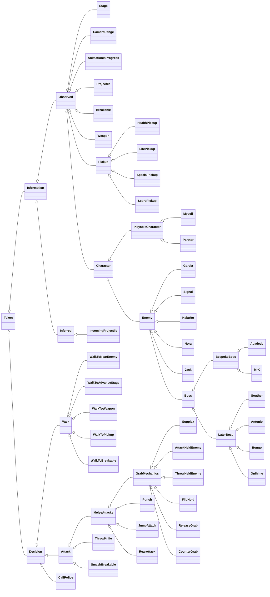

# Token Map

Mermaid class diagram of the AI token hierarchy under
`src/sor_autoplay/ai/`: the token classes and their inheritance only.
Keep this diagram in sync with the `ai/` sources — see `CLAUDE.md`.

